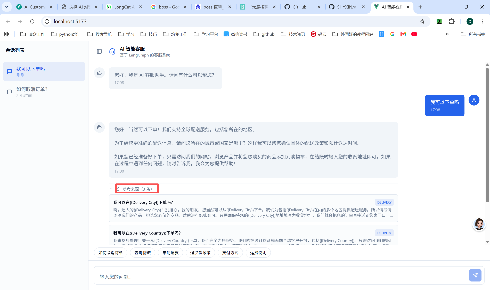

# AI 客服系统

基于 LangGraph + FastAPI + React 的智能客服系统。



## 架构

```
ai-customer-support/
├── backend/          # FastAPI + LangGraph + Chroma
│   ├── app/          # 应用代码
│   ├── data/         # Bitext 数据 + Chroma 持久化
│   └── requirements.txt
├── frontend/         # React + Vite + Shadcn UI
│   └── src/
└── docker-compose.yml
```

## 快速开始

### 后端

```bash
cd backend
cp .env.example .env
# 编辑 .env 配置 API 密钥
uv run uvicorn app.main:app --reload --port 8000
```

### 前端

```bash
cd frontend
npm install
npm run dev
```

## 技术栈

- **大模型**: LongCat API（OpenAI 兼容格式）
- **嵌入模型**: BAAI/bge-small-zh-v1.5（ONNX 本地推理）
- **向量数据库**: Chroma（本地持久化）
- **智能体编排**: LangGraph
- **后端框架**: FastAPI
- **前端框架**: React + Vite + Shadcn UI
